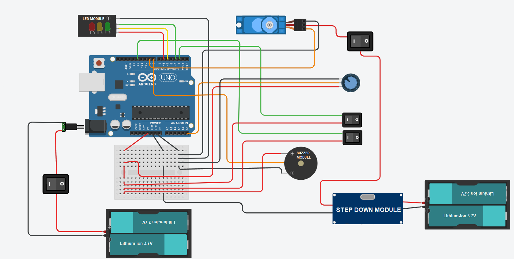
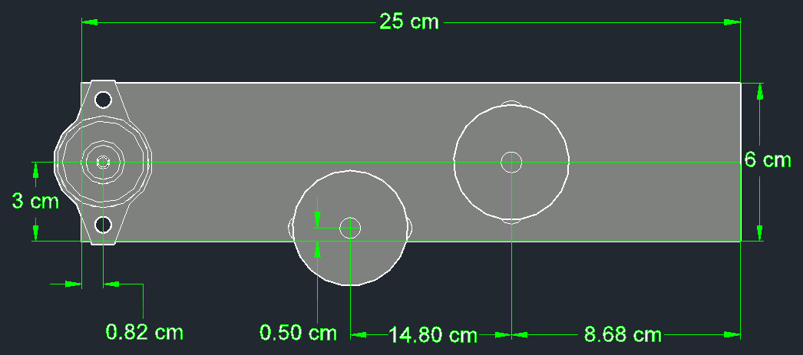
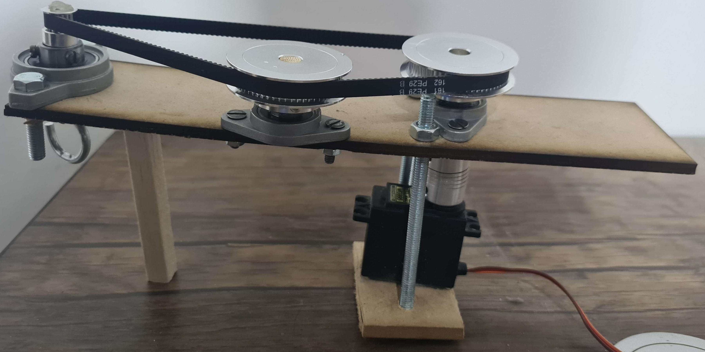
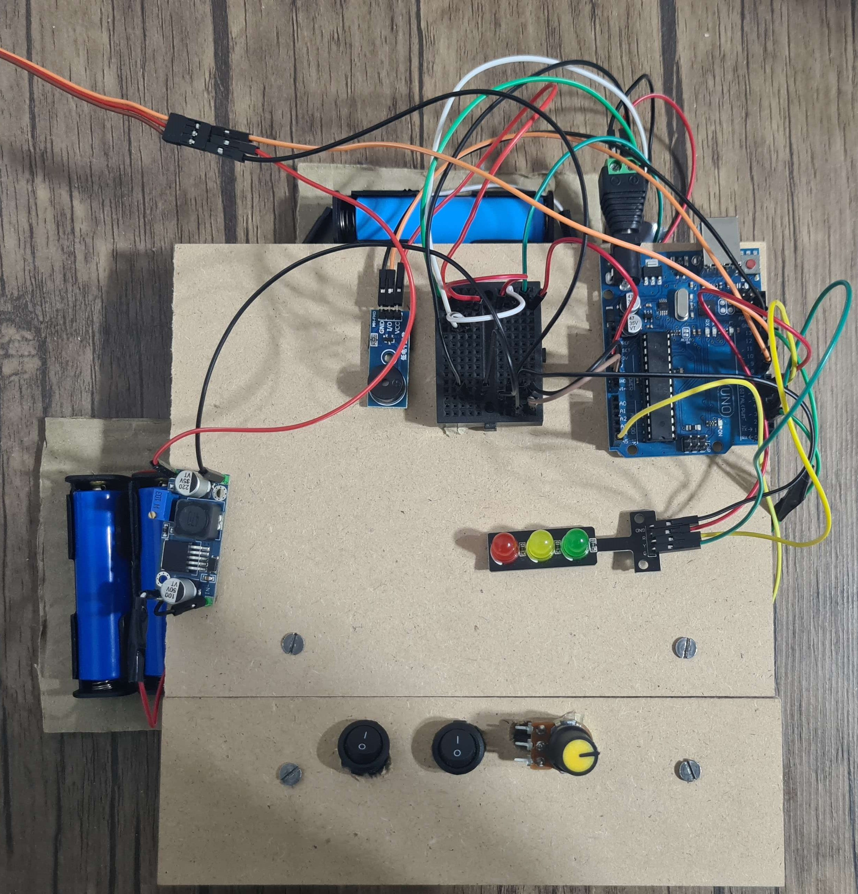

# Gear Control System
A multi-purpose, simple DIY Arduino-based gear control system featuring multiple modes for enhanced functionality

## Features
- Multi-use system for multiple purposes
- precise motion control
- Optimized for extended battery life for sustained use

## Parts List
These are the components I used to build the DIY Arduino-based gear control system:

| Component                 | Quantity | Description                                      |
|---------------------------|----------|--------------------------------------------------|
| Arduino Uno               | 1        | The main microcontroller board                   |
| 180 degree motor (MG995)  | 1        | Servo motor to rotate the gears                  |
| Shaft Coupling 8x8        | 1        | 8mm-to-8mm Jaw shaft coupling converter          |
| 60-teeth gear             | 2        | 60-teeth gear with 6mm width                     |
| 20-teeth gear             | 1        | 20-teeth gear with 6mm width                     |
| 8mm shaft                 | 1        | 8mm shaft for the two 60-teeth gear              |
| 8mm Bearing Shaft         | 2        | Bearing with 8mm bore                            |
| 12mm Bearing Shaft        | 1        | Bearing with 12mm bore                           |
| 6mm width Pulley belt     | 1        | Pulley belt that is suitable for the design to tight fit|
| 8mm shaft hook            | 1        | Hook with 8mm shaft                              |
| LED Traffic Lights        | 1        | Red, yellow, and green LED traffic signal lights |
| Buzzer                    | 1        | 5V Buzzer module                                 |
| 10kΩ Potentiometer        | 1        | Potentiometer for controlling the servo motor's angle|
| Small Switch              | 2        | 2-pin small ON/OFF switch                        |
| Large Switch              | 2        | 2-pin large ON/OFF switch                        |
| Buck Step-Down Converter  | 1        | 24V/12V to 5V, 5A DC-DC buck step-down converter |
| Power adapter             | 1        | Male DC Power adapter 2.1mm plug                 |
| 3.7V Li-ion Battery       | 4        | Lithium-ion battery 18650, 3.7V, 4300mAh, rechargeable|
| 2X Battery holder         | 2        | Battery holder for 2x 18650 batteries (connected in series)|
| Jumper Wires              | Several  | For wiring connections                           |
| Breadboard                | 1        | To expand pin connections for the Arduino        |
| 25x6cm board              | 1        | To hold all parts together                       |

## Arduino Connection and System Overview

### LED Status Indicator 🟩🟨🟥
- **Green** : Auto mode (default)
- **Yellow** : Manual mode
- **Red** : Stop mode

### Power Setup 🔋
- **Arduino Power:** Powered by two 3.7V lithium-ion batteries connected in series, providing a total of 7.4V.
- **Motor Power:** Powered by two 3.7V lithium-ion batteries connected in series and stepped down to 6.2V to meet motor requirements.

### Buzzer 🔊
- **Provides an audible beep to signal when the mode is changed.**

### Switches 1️⃣/0️⃣
- **Two on/off switches toggle Manual or/and Stop modes.** (default mode is Auto)

### Potentiometer Ω
- **Allows the user to adjust the servo motor's angle in Manual mode, translating analog input to servo angle.**

### Additional Switches
- **One switch turns the servo on/off.**
- **One switch powers the Arduino on/off.**

## Mechanical System

### Gear System Motion ⚙️
- **The motor drives a 60-teeth gear via an 8mm shaft and 8mm-to-8mm converter for added stability.**
- **The gear rotates on a bearing shaft, transferring motion to another 60-teeth gear through a pulley belt that maintains tension for smooth motion.**
- **The system includes a 20-teeth gear connected to a hook on the bearing shaft and rotates from the second 60-teeth gear through the same pulley belt**
### Precise Angle control 📐
- **180-degree servo motor is used to achieve precise motion control.**
- **Since the servo motor doesn’t complete a full rotation, the system uses a 60-teeth to 20-teeth gear ratio.**
- **This allows for a full 360° rotation by combining one complete and one half-rotation of the servo.**

## The Code
👉 Full code: [code.ino](code.ino)

<pre> <code> 
Servo myservo;  

const int stopPin = 12;  
const int manualPin = 2;
const int buzzerPin = 8;
const int potPin = A5;
const int greenPin = 3;
const int yellowPin = 5;
const int redPin = 6;

bool checkConditions = false;

void setup() {
  myservo.attach(9);
  
  pinMode(stopPin, INPUT_PULLUP);
  pinMode(manualPin, INPUT_PULLUP);

  pinMode(buzzerPin, OUTPUT);
  pinMode(greenPin, OUTPUT);
  pinMode(yellowPin, OUTPUT);
  pinMode(redPin, OUTPUT);

  Serial.begin(9600);
}
</code> </pre>

## Prototype

