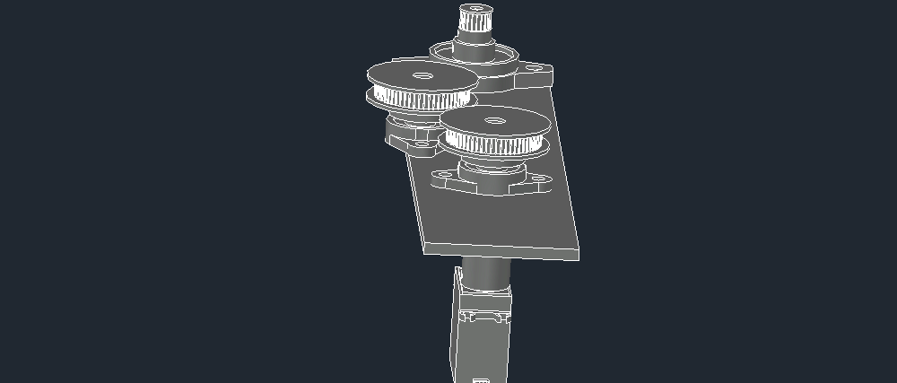

# Gear Control System
A multi-purpose, simple DIY Arduino-based gear control system featuring multiple modes for enhanced functionality

## Features
- Multi-use system for multiple purposes
- precise motion control
- Optimized for extended battery life for sustained use

## Parts List
These are the components I used to build the DIY Arduino-based gear control system:

| Component                 | Quantity | Description                                      |
|---------------------------|----------|--------------------------------------------------|
| Arduino Uno               | 1        | The main microcontroller board                   |
| 180 degree motor (MG995)  | 1        | Servo motor to rotate the gears                  |
| Shaft Coupling 8x8        | 1        | 8mm-to-8mm Jaw shaft coupling converter          |
| 60-teeth gear             | 2        | 60-teeth gear with 6mm width                     |
| 20-teeth gear             | 1        | 20-teeth gear with 6mm width                     |
| 8mm shaft                 | 1        | 8mm shaft for the two 60-teeth gear              |
| 8mm Bearing Shaft         | 2        | Bearing shaft with 8mm bore                      |
| 12mm Bearing Shaft        | 1        | Bearing shaft with 12mm bore                     |
| 8mm shaft hook            | 1        | Hook with 8mm shaft                              |
| LED Traffic Lights        | 1        | Red, yellow, and green LED traffic signal lights |
| Buzzer                    | 1        | 5V Buzzer module                                 |
| 10kΩ Potentiometer        | 1        | Potentiometer for controlling the servo motor's angle|
| Small Switch              | 2        | 2-pin small ON/OFF switch                        |
| Large Switch              | 2        | 2-pin large ON/OFF switch                        |
| Buck Step-Down Converter  | 1        | 24V/12V to 5V, 5A DC-DC buck step-down converter |
| Power adapter             | 1        | Male DC Power adapter 2.1mm plug                 |
| 3.7V Li-ion Battery       | 4        | Lithium-ion battery 18650, 3.7V, 4300mAh, rechargeable|
| 2X Battery holder         | 2        | Battery holder for 2x 18650 batteries (connected in series)|
| Jumper Wires              | Several  | For wiring connections                           |
| Breadboard                | 1        | To expand pin connections for the Arduino        |
